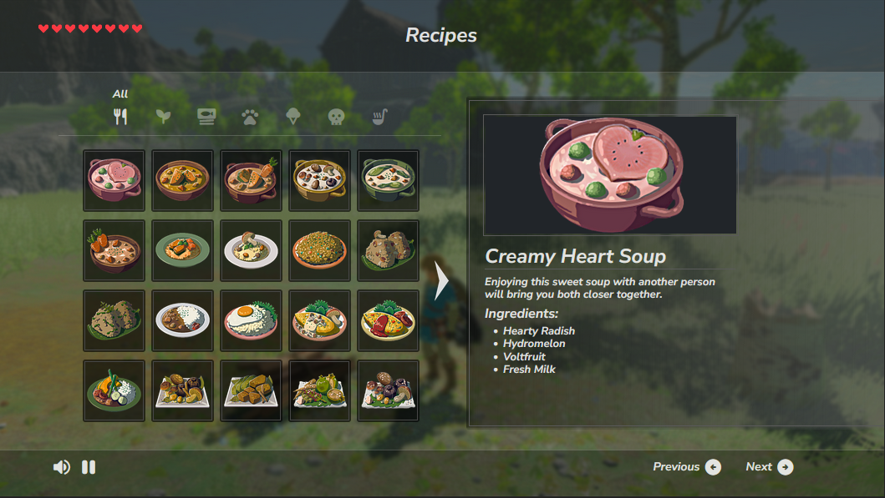

# The Legend of Zelda: Breath of the Wild Recipes



<div align="center">
  <h3>Go to website: <a href="">link</a>
</div>
<br><br>

Look up ingredients for your favorite recipes and use the filtered tabs to find specific recipes faster. The option to disable animations and sounds are toggled using the buttons on the bottom bar. The program was made using React, TypeScript, HTML, CSS, and Vite. <br><br>

**Disclaimer:** _The assets such as the images used in this project are the sole property of Nintendo, and I do not claim any ownership. Other assets used are credited in the resources below._

## Prerequisites
To install dependencies: ```npm i```

## Getting Started
To run: ```npm run dev```
<br><br>
Then go to website: http://localhost:5173/

## Resources
- Background image: [wccftech.com](https://wccftech.com/zelda-breath-of-the-wild-new-video-compares-dock-undocked-modes-performance-smoother-handheld-mode/)
- Website icon: [gamerguides.com](https://www.gamerguides.com/the-legend-of-zelda-tears-of-the-kingdom/database/food/food/energizing-mushroom-skewer)
- Recipe details (images + descriptions): [zeldadungeon.net](https://www.zeldadungeon.net/wiki/Creamy_Heart_Soup)
- Recipes list (names + categories + ingredients): [ign.com](https://www.ign.com/wikis/the-legend-of-zelda-breath-of-the-wild/All_Recipes_and_Cookbook)
- Recipes list (hearts): [game8.co](https://game8.co/games/Zelda-Breath-of-the-Wild/archives/293921)
- Screen layout reference: [medium.com](https://miro.medium.com/v2/resize:fit:1400/1*P1UlWpIUrKqQT1Izc9nCpw.jpeg)
- Sounds: [sounds-resource.com](https://www.sounds-resource.com/nintendo_switch/thelegendofzeldabreathofthewild/sound/12225/)
